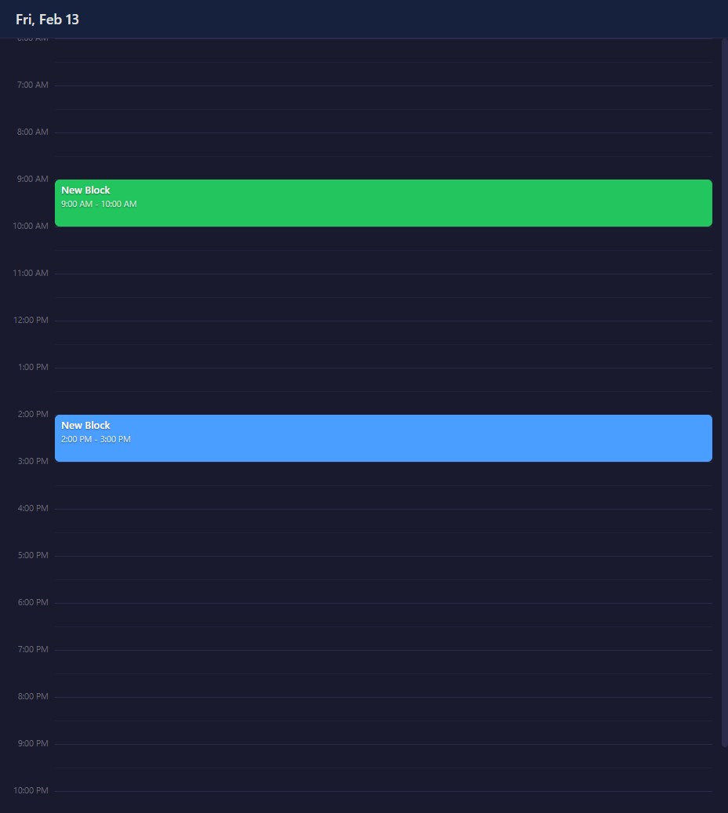
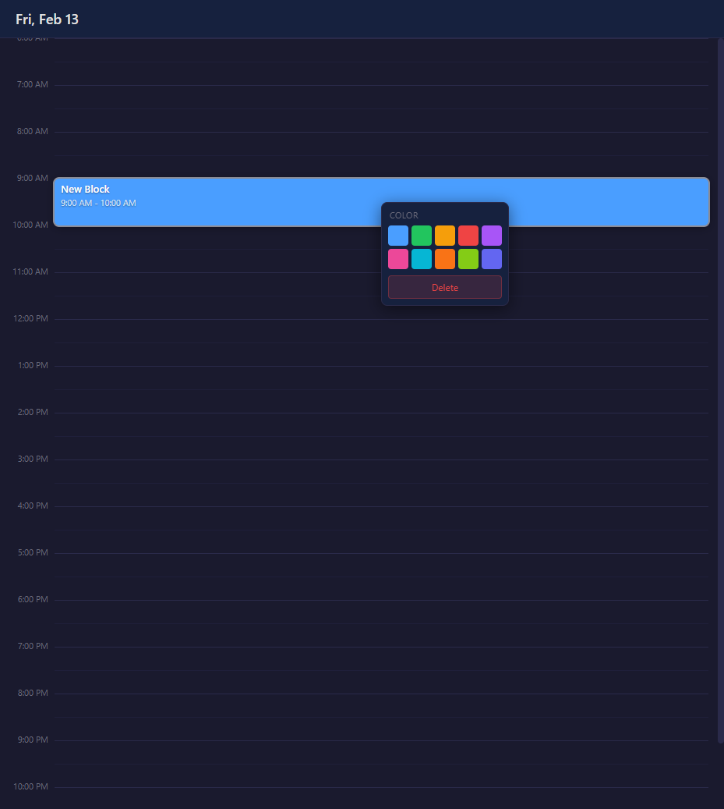

# TimeBlocker

A simple desktop app for time-blocking your day. Drag to create blocks, move and resize them, color-code by category, and everything saves automatically as readable markdown files.





## Features

- **Drag to create** — Click and drag on the timeline to create a new block (auto-enters edit mode so you can type a title immediately)
- **Move and resize** — Drag blocks to reposition them, or pull the edges to adjust duration
- **Color-code** — Right-click any block to pick from 10 preset colors
- **Duplicate and delete** — Right-click context menu includes Duplicate to clone a block and Delete to remove it (or press the Delete key)
- **Done checkbox** — Click the checkbox on any block to mark it complete (turns green with a checkmark)
- **Inline editing** — Click a block's title to rename it in place (Enter to confirm, Escape to cancel)
- **Overlapping blocks** — Overlapping blocks display side-by-side (like Google Calendar) instead of stacking on top of each other
- **Multi-select** — Ctrl+click to select multiple blocks and move, delete, or recolor them together
- **Ctrl+scroll zoom** — Ctrl+mousewheel zooms the timeline in and out, from a compact day overview to fine-grained placement
- **"Now Doing" panel** — The bottom of the main window highlights your currently active time block
- **Floating widget** — Toggle an always-on-top mini window that shows your current time block with a live countdown timer, plus a preview of the next upcoming block. Visible even when the app is in the background. Pulses when the active block changes so you don't miss transitions. Click it to bring the main window to focus
- **Update notifications** — On startup, the app checks GitHub for newer releases. If one is available, a small badge appears in the header; clicking it opens the release page in your browser
- **Day navigation** — Arrow buttons in the header let you browse previous days; the right arrow is disabled on today to prevent navigating into the future. The current time line and "Now Doing" panel only appear when viewing today
- **Current time line** — A red line shows the current time, updating every minute
- **15-minute snap grid** — All times snap to 15-minute increments
- **Auto-save** — Changes save automatically after 300ms of inactivity
- **Markdown storage** — Data is stored as human-readable `.md` files you can open in any text editor

## Getting Started

### Prerequisites

- [Node.js](https://nodejs.org/) (v18 or later recommended)

### Install

```bash
git clone <repo-url>
cd TimeBlockingApp
npm install
```

### Development

```bash
npm run dev
```

This compiles the main process TypeScript, starts the Vite dev server on port 5173, and launches Electron.

### Production Build

```bash
npm run build
npm start
```

### Package as Portable Windows Exe

```bash
npm run pack
```

Output goes to the `release/` directory.

## Data Storage

Each day is saved as a markdown file in your user data directory under `days/YYYY-MM-DD.md`. The format looks like this:

```markdown
# Friday, February 13, 2026

## 09:00 - 10:00 | Morning Planning
- **Color:** #4a9eff
- **ID:** m1abc2def

## 14:00 - 15:30 | Deep Work
- **Color:** #2ecc40
- **ID:** k9xyz8ghi
- **Done:** true
```

Files are fully readable and editable outside the app.

## Tech Stack

- **Electron 33** — Desktop shell
- **React 19** — UI framework
- **TypeScript 5** — Type safety
- **Vite 6** — Build tooling

## License

MIT
